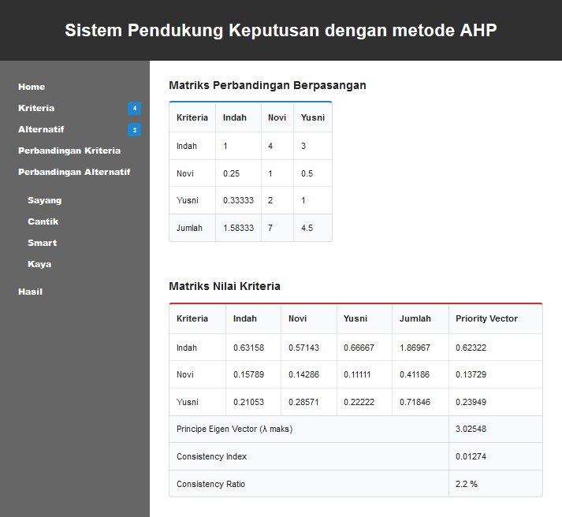

# analytic-hierarchy-process
Simple decision support system application with AHP method.

## Installation
- create new database in MySQL server (phpMyAdmin)
- edit file config.php
- import database/database.sql into your new database
- run your website

## Screenshot

